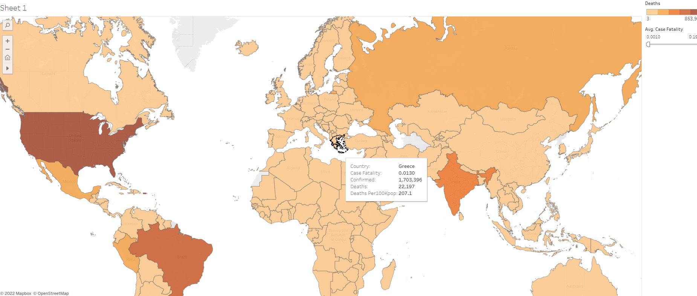

# Web-Scraping-with-Python
## Global data for Corona Virus

## Project overview
The project is about corona virus around the globe.  
I wrote some cool python code to access the data from https://coronavirus.jhu.edu/data/mortality .   
Stored the data in DB Browser (SQLite) and then I imported them in Tableau to make a nice Viz!

Tools: Python,SQlite,Tableau,PowerBI

## Python Coding
Libraries used: BeautifulSoup,Re,Urllib,Sqlite.       
Ok, so I used urllib to connect with the site and Beautifulsoup to parse the html and target the tags
containing the information. Then, I used Regular Expression to extract the strings inside the tags. Finally,
I used sqlite lib and wrote some code to create SQL tables and a for loop to insert the data in SQLite. The 
programm called 'corona.py'. You can access it **[here](https://github.com/DimKaisaris/Web-Scraping-with-Python/tree/main/Python%20Code)**
In this folder there is some other python code which I wrote during the process which is part of corona.py , as well the sqlite files and an exported .csv  
used to connect with tableau.

## SQLite
The data was last updated on 19/1/2022. Take a look at the result as created automatic in Sqlite after I ran my python code!

Then I ran some simple queries.

Finally I saved tha data in .csv format to connect with Tableau, beacuse at the moment Tableau public  
doesnt support sqlite files.  
You can access the sql table, queries and csv file using the same folder used for the python code above!

## Tableau
After I imported the data in Tableau, i made a nice viz! 
If you wish, visit my profile and click on CoronaData to check it out! [link](https://public.tableau.com/app/profile/dimitris.kaisaris4695)

## PowerBI
Finally, I imported the data in PowerBI and build a report, containing a map,  
table data and some slcers. Check the pbix **[file](https://github.com/DimKaisaris/Web-Scraping-with-Python/blob/main/images/PBImap.pbix)**

  

